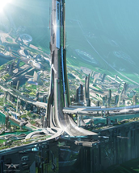
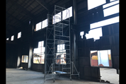
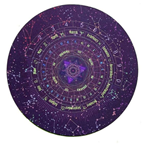

# With Girls who “Keep on Operating”

## Core Idea

### Logline

In the other world, where the concept of living things is completely different, you seek to find out if there is any way to teach the identity to the girl Shinoka (an evolved species of AI), who fights against a harsh fate to "keep on operating", and what will be left past the truth of it all.

### Story

When Shinoka, a young girl, participates in a "coming-of-age" ceremony at the age of 12, she is targeted by a "recovery robot" that is infiltrated into the ceremony, and after her first "wreck" and being taken for "repair," she meets an AI god who tells her that she is a "machine" for reasons she does not understand. Luckily, she escapes from the "repair" but is chased by the "recovery" and saved by the god at every turn. Shinoka notices something strange and begins to unravel the message left by someone else. Gradually, Shinoka realizes that the human creature has perished and that she is a "machine" with human genes, from which she takes a new step forward.

### Tone

Overall: A different norm, organic, unpopular and desolate, mysterious technology and magic coexist.

System Core: Divine, supernatural, virtual, magical, inorganic

## Game Format

### Game Play

Visual adventure with light puzzle elements

1.	First, the player as a limited god AI goes through the scene via electronic devices limited in number freely and leave messages to Shinoka by using them. How the player can jump around devices and the usage of them depend on the device type.
2.	Second, the player dives into Shinoka and experiences the environment and branching storylines in an uncontrollable abstract first-person view.

### Setting
A hyper-developed world where two types of mechanical life forms face off against each other and are connected to the old real world.

## Reference

The images below are gethered from the Internet. The rights are all reserved by their authors. If it's not usable, please contact me for deletion.

### World Building Principles
A mechanical world together with full of magic. Characters do daily stuff usually with magic mediating from mechanical parts from the environment. High level lifeforms are natural viewing from outside but actually mechanical if dissected while low level ones are fully mechanical. Their habitants are different.

## Flavor

Worldview and gameplay revolve around and fully utilize the 4th wall to deliver a super meta experience. The alien game world connects with the real world the player is in. However, the only person who is aware is the player. Life of characters inside the game world is normal for them but harsh from the player perspective. The player will try to inform and interact with the girls indirectly despite the language isn’t shared, and also explore together how the order in the game world was formed.
